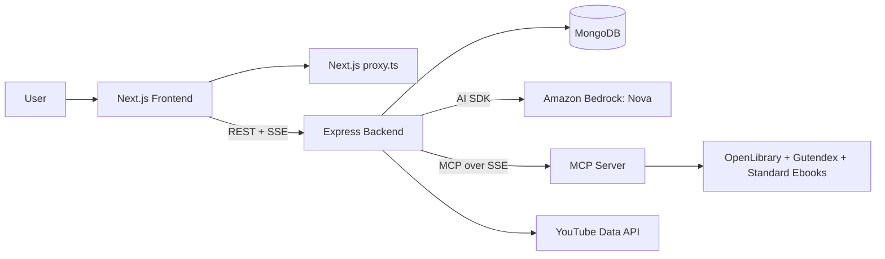
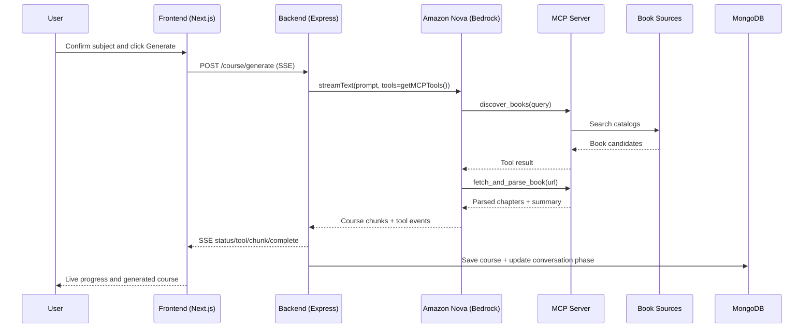

<p align="center">
  
</p>

# TheTutor
**Just Ask.**

---
<p align="center">
  <a href="#"></a>
  <a href="./LICENSE"></a>
  <a href="#tech-stack"></a>
</p>

## Table of Contents

- [Overview](#overview)
- [Core Features](#core-features)
- [Tech Stack](#tech-stack)
- [Architecture](#architecture)
- [Nova + MCP Integration](#nova--mcp-integration-judge-focus)
- [Project Structure](#project-structure)
- [API Surface](#api-surface)
- [Local Setup](#local-setup)
- [Environment Variables](#environment-variables)
- [Development Notes](#development-notes)
- [Developers](#developers)
- [License](#license)
<!-- - [Contributors](#contributors) -->
## Overview

TheTutor is an AI-powered learning platform where users sign in with Google, chat with an onboarding tutor, confirm a subject, and generate a structured course with modules, lessons, quizzes, exercises, and video resources.

Our Tagline: **Just Ask**.

## Core Features

- Google OAuth login with JWT stored in secure `httpOnly` cookies.
- Guided onboarding chat that collects topic, level, study time, and goal.
- AI-generated subject suggestion and confirmation flow.
- Real-time course generation streamed to the UI via SSE.
- Tool-augmented generation using MCP tools (book discovery + parsing).
- Persistent course, conversation, and progress storage in MongoDB.
- YouTube video enrichment for lesson-level study resources.
- Route protection and onboarding gatekeeping in `frontend/proxy.ts`.

## Tech Stack

<p align="center">
  
</p>

| Layer | Technologies |
|---|---|
| Frontend | Next.js 16, React 19, TypeScript, Tailwind CSS 4 |
| Backend | Express, TypeScript, Node.js |
| AI | Amazon Bedrock (`@ai-sdk/amazon-bedrock`) with Amazon Nova |
| MCP Integration | `@ai-sdk/mcp` over SSE transport |
| Data | MongoDB + Mongoose |
| Auth | Google OAuth 2.0 (Passport.js) + JWT cookie auth |
| Media Enrichment | YouTube Data API |

## Architecture



## Nova + MCP Integration (Judge Focus)

This project connects Amazon Nova and MCP directly in the generation path:

1. `POST /course/generate` starts an SSE stream from backend to frontend.
2. Backend calls `streamCourseWithMCPTools(...)`.
3. `getMCPTools()` creates an MCP client using `@ai-sdk/mcp` over SSE (`MCP_SSE_URL`).
4. The same `streamText(...)` call sends model + tools in one loop.
5. Model: Amazon Nova via Bedrock (`AI_MODEL`, default `us.amazon.nova-pro-v1:0`).
6. Tools: MCP-discovered tools (`discover_books`, `fetch_and_parse_book`, `search_books`).
7. Nova decides when to invoke MCP tools while generating the course.
8. Tool calls and tool results are streamed back as SSE events to the frontend.
9. Final generated markdown is parsed into modules/lessons and saved in MongoDB.

### End-to-End Sequence



### Source Pointers

- Nova model config: `backend/src/config/ai.ts`
- Nova generation + tool streaming: `backend/src/services/ai/nova.ts`
- MCP client + tool registration: `backend/src/services/mcp/mcpClient.ts`
- HTTP MCP fallback client: `backend/src/services/mcp/client.ts`
- Course generation orchestrator: `backend/src/services/course/generator.ts`

## Project Structure

```text
TheTutor/
├── frontend/                     # Next.js app (UI + route protection)
│   ├── src/app/                  # App Router pages
│   ├── src/components/           # UI, onboarding, dashboard, settings
│   ├── src/lib/api.ts            # Backend fetch helper
│   └── proxy.ts                  # JWT-based route protection
├── backend/                      # Express API
│   ├── src/routes/               # auth, user, chat, course endpoints
│   ├── src/services/ai/          # Amazon Nova prompts + generation
│   ├── src/services/mcp/         # MCP connectivity and discovery adapters
│   ├── src/services/course/      # course generation orchestrator
│   ├── src/models/               # MongoDB models
│   └── src/config/               # DB, auth, AI configs
├── docs/
│   └── The Tutor-logo/           # Branding assets
├── mcp.md                        # External MCP service reference
└── README.md
```

## API Surface

Key backend routes:

- `GET /health` - backend health check.
- `GET /auth/google` - start Google OAuth.
- `GET /auth/google/callback` - OAuth callback and JWT cookie issue.
- `GET /auth/me` - authenticated user payload.
- `POST /chat/message` - onboarding conversation turn.
- `POST /chat/confirm-subject` - confirm or revise suggested course subject.
- `POST /course/generate` - SSE course generation stream.
- `GET /course/generation-status/:conversationId` - generation status by conversation.
- `GET /course` - list user courses.
- `GET /course/:id` - get full course details.

## Local Setup

### Prerequisites

- Node.js 18+
- npm
- MongoDB (local or Atlas)
- Google OAuth app credentials
- AWS credentials with Bedrock access to Amazon Nova

### 1. Install dependencies

```bash
cd backend
npm install

cd ../frontend
npm install
```

### 2. Configure environment variables

Create:

- `backend/.env`
- `frontend/.env.local`

Use the variable tables below.

### 3. Run backend

```bash
cd backend
npm run dev
```

Backend default: `http://localhost:5000`

### 4. Run frontend

```bash
cd frontend
npm run dev
```

Frontend default: `http://localhost:3000`

### 5. (Optional) Run local MCP server

If you are not using the hosted MCP endpoint, run your MCP service locally and set:

- `MCP_SSE_URL=http://0.0.0.0:8002/mcp/sse`
- `MCP_BASE_URL=http://localhost:8002`

## Environment Variables

### Backend (`backend/.env`)

| Variable | Required | Example | Purpose |
|---|---|---|---|
| `PORT` | No | `5000` | Express server port |
| `FRONTEND_URL` | Yes | `http://localhost:3000` | CORS + post-auth redirect target |
| `MONGODB_URI` | Yes | `mongodb://127.0.0.1:27017/thetutor` | MongoDB connection string |
| `GOOGLE_CLIENT_ID` | Yes | `xxx.apps.googleusercontent.com` | Google OAuth client ID |
| `GOOGLE_CLIENT_SECRET` | Yes | `xxxx` | Google OAuth client secret |
| `JWT_SECRET` | Yes | `super-long-random-secret` | JWT signing secret |
| `AWS_REGION` | Yes | `us-east-1` | Bedrock region |
| `AWS_ACCESS_KEY_ID` | Yes | `AKIA...` | AWS credential for Bedrock |
| `AWS_SECRET_ACCESS_KEY` | Yes | `...` | AWS credential for Bedrock |
| `AI_MODEL` | No | `us.amazon.nova-pro-v1:0` | Amazon Nova model ID |
| `MCP_BASE_URL` | No | `https://futher-mcp-production.up.railway.app` | HTTP MCP endpoints |
| `MCP_SSE_URL` | No | `http://0.0.0.0:8002/mcp/sse` | MCP SSE transport URL |
| `YOUTUBE_API_KEY` | Optional | `AIza...` | YouTube lesson video lookup |
| `SEED_DEMO_COURSES` | No | `true` | Enable or disable demo seeding |
| `GENERATION_ADAPTER_MODE` | No | `stub` / `remote` | Alternate generation adapter mode |
| `GENERATOR_ENDPOINT` | Optional | `https://...` | Remote generator endpoint |

### Frontend (`frontend/.env.local`)

| Variable | Required | Example | Purpose |
|---|---|---|---|
| `NEXT_PUBLIC_BACKEND_URL` | Yes | `http://localhost:5000` | Browser-facing backend base URL |
| `JWT_SECRET` | Yes | `super-long-random-secret` | JWT verification in `proxy.ts` |

## Development Notes

- Build status badge is marked as `local check required` because CI is not configured in this repository.
- Current local build checks fail in this workspace due dependency/workspace configuration issues and type errors in legacy files.
- Recommended next step for a green build badge is adding a CI workflow.
- Frontend CI command: `npm ci && npm run lint && npm run build`
- Backend CI command: `npm ci && npm run build`

## Developers

| Name | Responsibility | GitHub |
|---|---|---|
| Tobiloba Sulaimon | FULL STACK AND CHIEF TECHNOLOGY OFFICER (CTO) | [tobilobacodes00](https://github.com/tobilobacodes00) |
| Fadhan Daniel| BACKEND ENGINNER | [fadexadex](https://github.com/fadexadex) |
| Robert Dominic | FRONTEND DEVELOPER| [Webnova](https://github.com/robert-dominic) |
| Joanna Bassey | FRONTEND DEVELOPER | [DevBytes-J](https://github.com/DevBytes-J) |
| Lex Luthor | MCP ENGINEER | [Contractor-x](https://github.com/Contractor-x) |


<!--- ## Contributors

| Name | Role | GitHub |
|---|---|---|
| Contributor 1 | Contributor | [Profile]() |
| Contributor 2 | Contributor | [Profile]() |
| Contributor 3 | Contributor | [Profile]() |
-->

## License

This project is licensed under the MIT License. See [LICENSE](./LICENSE).
