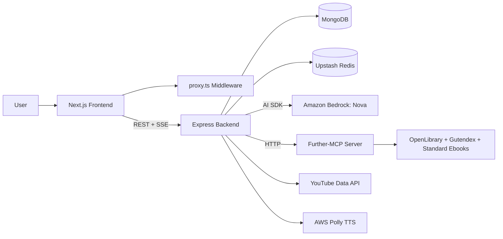
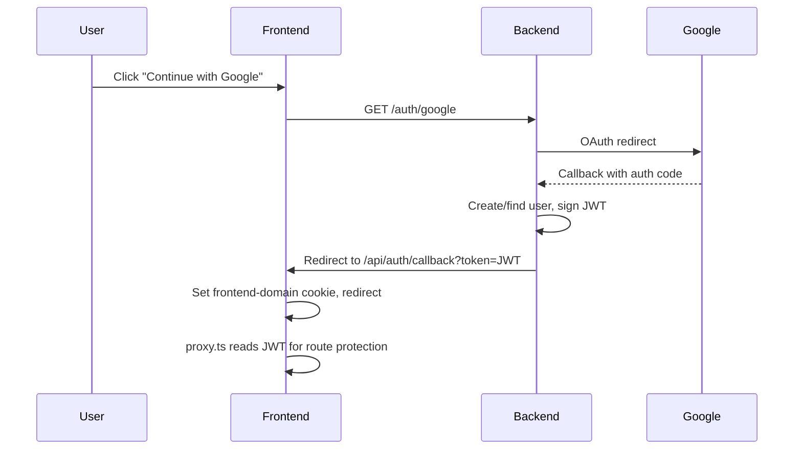
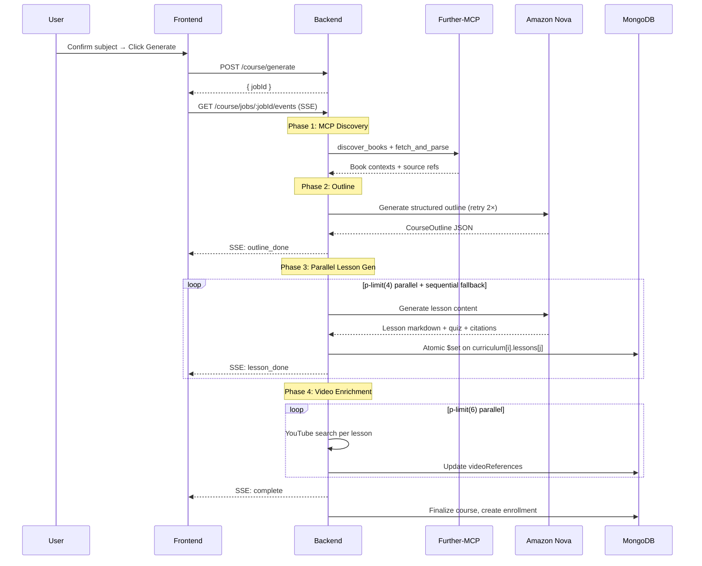

<p align="center">
 
</p>

  ---

# **TheTutor**

<p align="center">
  <a href="#"></a>
  <a href="./LICENSE"></a>
  <a href="#tech-stack"></a>
</p>


- [Overview](#overview)
- [Core Features](#core-features)
- [Tech Stack](#tech-stack)
- [Architecture](#architecture)
- [Course Generation Pipeline](#course-generation-pipeline)
- [Further-MCP](#further-mcp)
- [Project Structure](#project-structure)
- [API Surface](#api-surface)
- [Local Setup](#local-setup)
- [Environment Variables](#environment-variables)
- [Documentation](#documentation)
- [Developers](#developers)
- [License](#license)

## Overview

TheTutor is an AI-powered learning platform where users sign in with Google, chat with an onboarding tutor, confirm a subject, and generate a structured course with modules, lessons, quizzes, exercises, and video resources — all powered by Amazon Nova via AWS Bedrock and real textbook content from MCP-integrated book sources.

Our Tagline: **Just Ask**.

## Core Features

- Google OAuth login with JWT stored in secure `httpOnly` cookies
- Guided onboarding chat that collects topic, level, study time, and goal
- AI-generated subject suggestion and confirmation flow
- Job-based course generation with real-time SSE progress updates
- MCP-powered book discovery + parsing for grounded content
- Two-pass parallel lesson generation with sequential fallback
- YouTube video enrichment for lesson-level study resources
- Open-ended quiz grading via AI evaluation
- Course certificates on completion
- Explore page for published courses with text search
- Route-aware dark/light theme system
- Route protection and onboarding gatekeeping via `proxy.ts`

## Tech Stack

<p align="center">
  
</p>

| Layer | Technologies |
|---|---|
| Frontend | Next.js 16, React 19, TypeScript, Tailwind CSS 4, Framer Motion |
| Backend | Express, TypeScript, Node.js, Zod validation |
| AI | Amazon Bedrock (`@ai-sdk/amazon-bedrock`) with Amazon Nova |
| MCP Integration | Further-MCP (HTTP + FastMCP) for book discovery/parsing |
| Data | MongoDB + Mongoose, Upstash Redis (caching) |
| Auth | Google OAuth 2.0 (Passport.js) + JWT cookie auth |
| Media | YouTube Data API, AWS Polly (TTS) |
| Logging | Pino structured logging |

## Architecture



### Auth Flow



## Course Generation Pipeline

The generation pipeline uses a job-based architecture with 4 phases:



### Key Files

| File | Purpose |
|---|---|
| `backend/src/services/course/jobRunner.ts` | 4-phase pipeline orchestrator |
| `backend/src/services/course/lessonGen.ts` | Single lesson content generation |
| `backend/src/services/course/outline.ts` | Course outline generation |
| `backend/src/services/mcp/discovery.ts` | MCP book discovery pipeline |
| `backend/src/services/sse/broadcaster.ts` | SSE client management |
| `backend/src/config/ai.ts` | Nova model config per phase |

## Further-MCP

> TheTutor uses a **custom MCP** built specifically for this project so Amazon Nova can discover, fetch, and parse real books before generating course content.

<p align="center">
  <a href="https://github.com/TECHIES-V1/futher-mcp"></a>
  <a href="https://futher-mcp-production.up.railway.app"></a>
  <a href="https://futher-mcp-production.up.railway.app/health"></a>
</p>

**Repository:** [https://github.com/TECHIES-V1/futher-mcp](https://github.com/TECHIES-V1/futher-mcp)
**Live on Railway:** [https://futher-mcp-production.up.railway.app](https://futher-mcp-production.up.railway.app)
**Health Check:** [https://futher-mcp-production.up.railway.app/health](https://futher-mcp-production.up.railway.app/health)

Further-MCP combines OpenLibrary discovery with EPUB/PDF parsing and exposes both FastAPI routes and FastMCP tools. In TheTutor, this powers book discovery and content extraction during course generation.

| Capability | What Further-MCP Provides | How TheTutor Uses It |
|---|---|---|
| Discovery | OpenLibrary + Gutendex + Standard Ebooks aggregation | Finds high-signal books for a learner topic |
| Parsing | EPUB/PDF metadata, TOC, chapter extraction | Feeds structured source context to Nova |
| Interfaces | FastAPI + FastMCP pack | Works for HTTP pipelines and MCP tool mode |
| Hosting | Railway deployment | Production-ready MCP endpoint for generation flow |

### FastMCP Tools

- `discover_books(query, sources?, limit?)`
- `fetch_and_parse_book(url, limit_pages?, limit_chapters?)`
- `search_books(query, keywords?, limit?)`

## Project Structure

```text
TheTutor/
├── frontend/                         # Next.js 16 app
│   ├── src/app/                      # App Router pages
│   │   ├── (main)/                   # Authenticated app (dashboard, learn, explore, settings)
│   │   ├── auth/                     # Sign-in page
│   │   └── api/auth/                 # OAuth callback + logout handlers
│   ├── src/components/
│   │   ├── ui/                       # shadcn/ui components
│   │   ├── landing/                  # Marketing page sections
│   │   ├── dashboard/                # Sidebar, empty states
│   │   ├── onboarding/              # Course creation chat UI
│   │   ├── course/                   # Lesson viewer, AI assistant, quiz
│   │   ├── explore/                  # Course discovery components
│   │   └── providers/                # AuthProvider, ThemeProvider
│   ├── src/lib/                      # api.ts, seo.ts, backendUrl.ts
│   └── proxy.ts                      # JWT-based route protection middleware
├── backend/                          # Express API
│   ├── src/routes/                   # auth, user, chat, course, courses, dashboard, tts
│   ├── src/services/
│   │   ├── ai/                       # Nova prompts, generation, grading
│   │   ├── mcp/                      # MCP client + discovery pipeline
│   │   ├── course/                   # jobRunner, lessonGen, outline, contextBuilder
│   │   ├── sse/                      # SSE broadcaster + client management
│   │   ├── youtube/                  # YouTube video enrichment
│   │   └── cache/                    # Upstash Redis chat caching
│   ├── src/middleware/               # auth, sse, rateLimiter, validate, requestLogger
│   ├── src/models/                   # Mongoose schemas (User, Course, Enrollment, etc.)
│   ├── src/config/                   # database, passport, ai, logger, publicUrls
│   └── src/utils/                    # errors, auth helpers
├── docs/                             # Architecture, API reference, deployment guide
└── README.md
```

## API Surface

### Authentication
| Method | Path | Auth | Description |
|---|---|---|---|
| GET | `/auth/google` | No | Start Google OAuth flow |
| GET | `/auth/google/callback` | No | OAuth callback, issues JWT |
| GET | `/auth/me` | Yes | Current user payload |
| POST | `/auth/logout` | Yes | Clear auth cookie |

### Chat (Onboarding)
| Method | Path | Auth | Description |
|---|---|---|---|
| POST | `/chat/message` | Yes | Send onboarding chat message |
| POST | `/chat/confirm-subject` | Yes | Confirm/reject suggested subject |
| GET | `/chat/conversations` | Yes | List user conversations |
| GET | `/chat/conversation` | Yes | Get active conversation |
| GET | `/chat/conversation/:id` | Yes | Get conversation by ID |
| POST | `/chat/restart` | Yes | Restart onboarding |

### Course Generation
| Method | Path | Auth | Description |
|---|---|---|---|
| POST | `/course/generate` | Yes | Start job-based generation |
| GET | `/course/jobs/:jobId` | Yes | Poll job status (JSON) |
| GET | `/course/jobs/:jobId/events` | Yes | Real-time SSE stream |
| GET | `/course/generation-status/:id` | Yes | Legacy generation status |

### Courses
| Method | Path | Auth | Description |
|---|---|---|---|
| GET | `/courses/explore` | Optional | Browse published courses |
| GET | `/courses/:id/preview` | Optional | Course preview with outline |
| POST | `/courses/:id/enroll` | Yes | Enroll in a course |
| GET | `/courses/:id/lessons/:lessonId` | Yes | Get lesson content |
| POST | `/courses/:id/lessons/:lessonId/assistant` | Yes | AI lesson assistant (SSE) |
| POST | `/courses/:id/lessons/:lessonId/quiz-attempts` | Yes | Submit lesson quiz |
| POST | `/courses/:id/complete` | Yes | Complete course, get certificate |
| PATCH | `/courses/:id/publish` | Yes | Toggle course visibility |

### Dashboard & User
| Method | Path | Auth | Description |
|---|---|---|---|
| GET | `/dashboard/overview` | Yes | Dashboard stats + course cards |
| GET | `/user/profile` | Yes | Full user profile |
| PATCH | `/user/preferences` | Yes | Update theme preference |
| POST | `/tts/synthesize` | Yes | Text-to-speech synthesis |

## Local Setup

### Prerequisites

- Node.js 18+
- npm
- MongoDB (local or Atlas)
- Google OAuth app credentials
- AWS credentials with Bedrock access to Amazon Nova

### 1. Install dependencies

```bash
cd backend && npm install
cd ../frontend && npm install
```

### 2. Configure environment variables

Create `backend/.env` and `frontend/.env.local` — see tables below.

### 3. Run both servers

```bash
# Terminal 1
cd backend && npm run dev     # http://localhost:5000

# Terminal 2
cd frontend && npm run dev    # http://localhost:3000
```

## Environment Variables

### Backend (`backend/.env`)

| Variable | Required | Purpose |
|---|---|---|
| `MONGODB_URI` | Yes | MongoDB connection string |
| `JWT_SECRET` | Yes | JWT signing secret (must match frontend) |
| `GOOGLE_CLIENT_ID` | Yes | Google OAuth client ID |
| `GOOGLE_CLIENT_SECRET` | Yes | Google OAuth client secret |
| `FRONTEND_URL` | Yes | CORS + post-auth redirect (e.g. `http://localhost:3000`) |
| `AWS_ACCESS_KEY_ID` | Yes | AWS credential for Bedrock |
| `AWS_SECRET_ACCESS_KEY` | Yes | AWS credential for Bedrock |
| `AWS_REGION` | Yes | Bedrock region (e.g. `us-east-1`) |
| `AI_MODEL` | No | Nova model ID (default: `amazon.nova-pro-v1:0`) |
| `YT_API_KEY` | Optional | YouTube video enrichment |
| `MCP_BASE_URL` | No | Further-MCP HTTP endpoint |
| `PORT` | No | Express port (default: `5000`) |
| `LESSON_CONCURRENCY` | No | Parallel lesson gen workers (default: `4`) |
| `VIDEO_CONCURRENCY` | No | Parallel video fetch workers (default: `6`) |

### Frontend (`frontend/.env.local`)

| Variable | Required | Purpose |
|---|---|---|
| `NEXT_PUBLIC_BACKEND_URL` | Yes | Browser-facing backend URL |
| `JWT_SECRET` | Yes | JWT verification in `proxy.ts` (must match backend) |

## Documentation

Detailed documentation is available in the [`docs/`](docs/) directory:

- [Architecture](docs/architecture.md) — System design, auth flow, theme system
- [Course Generation](docs/course-generation.md) — Pipeline phases, crash recovery
- [API Reference](docs/api-reference.md) — Complete route documentation
- [Deployment Guide](docs/deployment.md) — Environment setup, production checklist

## Developers

| Name | Role | What They Built | GitHub |
|---|---|---|---|
| **Tobiloba Sulaimon** | Full-Stack Lead & CTO | Core architecture end-to-end: job-based generation pipeline (jobRunner, lessonGen, outline), AI streaming, MCP book discovery integration, voice/read-aloud highlighter, theme system (neumorphic + dark mode), Redis caching + rate limiting, MongoDB indexes, parallel lesson generation (p-limit), pino structured logging, dashboard, sidebar, authentication flow, all production bug fixes. 58+ commits. | [tobilobacodes00](https://github.com/tobilobacodes00) |
| **Daniel Fadehan** | Backend Engineer | Initial AI + MCP scaffold: foundational backend services (nova.ts, prompts.ts, generator.ts, mcpClient.ts), Course model schema, chat routes, SSE middleware, YouTube video service, type definitions, test suites (vitest + course.test.ts + nova.e2e.test.ts). ~4600 lines added in initial integration. | [fadexadex](https://github.com/fadexadex) |
| **Collins Joel** | MCP & Prompt Engineer | Subject taxonomy system (27 domain profiles with teaching styles, Bloom's levels), IBESTT teaching principles framework, MCP-first prompt flow, Upstash Redis caching layer (chatCache.ts + upstashRedis.ts), README documentation/branding. | [Contractor-x](https://github.com/Contractor-x) |
| **Robert Dominic** | Frontend Developer | Explore Courses page (modular component architecture), full Settings module (3 tabs: PersonalInfo, Security, Notifications), shared sidebar layout refactor, responsive fixes, legal pages (privacy, terms, about, contact), Vercel deployment config, course creation sidebar animation. 27 commits, ~1200+ lines. | [robert-dominic](https://github.com/robert-dominic) |
| **Joanna Bassey** | Frontend Developer & SEO | SEO implementation (metadata, sitemap.ts, robots.ts, OG image generation, structured data), sign-in page redesign, logout confirmation modal, footer/navbar polish, component cleanup. 8 commits, created 5+ new SEO files. | [DevBytes-J](https://github.com/DevBytes-J) |

## License

This project is licensed under the MIT License. See [LICENSE](./LICENSE).
