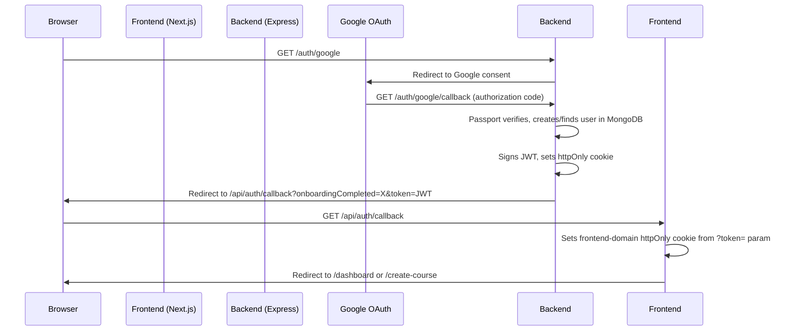
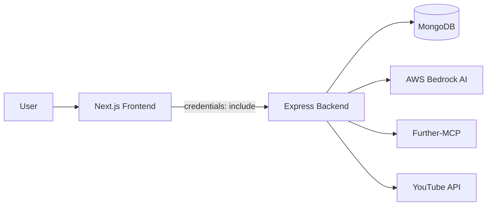

# System Architecture

## Monorepo Structure

TheTutor is a monorepo with two independent applications, each with its own `package.json`:

```
TheTutor/
  frontend/   # Next.js 16 + React 19 (port 3000)
  backend/    # Express + TypeScript (port 5000)
```

Both servers must run simultaneously for full functionality.

## Authentication Flow

Authentication is handled entirely by the backend using Passport.js with Google OAuth. The frontend has no auth library — it relies on httpOnly JWT cookies set by the backend.



### Route Protection (`proxy.ts`)

The Next.js middleware (`proxy.ts`) reads the frontend-domain JWT cookie using `jose` and enforces:

| Condition | Action |
|---|---|
| Unauthenticated + protected route | Redirect to `/auth/signin` |
| Authenticated + no course created | `/dashboard` redirects to `/create-course` |
| Authenticated + course created | `/create-course` redirects to `/dashboard` |
| Authenticated + sign-in page | Redirect to appropriate page |

### Cross-Origin Cookie Strategy

In production (Vercel + Render), cookies are set on both domains:
- **Backend cookie** — set during OAuth callback
- **Frontend cookie** — set by `/api/auth/callback` route from the `?token=` query param

Logout must clear both: `POST /auth/logout` (backend) and `POST /api/auth/logout` (frontend).

## Data Flow



All frontend API calls go through `src/lib/api.ts`, which wraps `fetch` with `credentials: "include"` and a base URL from `NEXT_PUBLIC_BACKEND_URL`.

## Theme System

TheTutor uses a dual-theme system:

- **Default:** Light theme (landing page, auth)
- **Dark:** Black/gold luxury theme (dashboard, course pages)

### Implementation

- A `data-theme` attribute on `<html>` controls the active theme
- `ThemeProvider` is route-aware — it checks the current path against `THEMED_PREFIXES` to determine which theme to apply
- Tailwind v4 dark mode is overridden via `@variant dark` to read from the `data-theme` attribute instead of `prefers-color-scheme`
- CSS variables define all theme colors (primary: `#d4af37`, background: `#0a0a0a` for dark)

### Design Tokens

- **Fonts:** Playfair Display (headings), Lato (body)
- **Utility classes:** `neo-surface`, `neo-inset`, `skeuo-gold` (gold gradient buttons/badges)
- **Animations:** Framer Motion throughout
