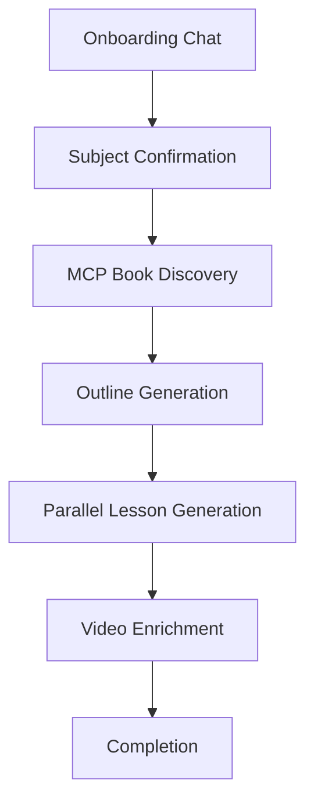
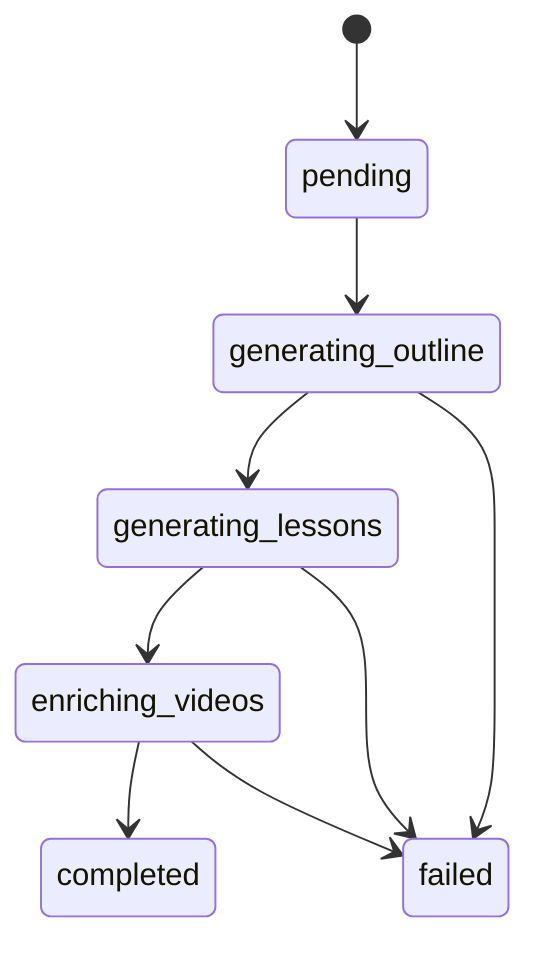

# Course Generation Pipeline

## Phase Overview

### 1. Onboarding Chat

The user interacts with an AI chat at `/create-course`. The conversation gathers preferences (topic, depth, learning style) before moving to confirmation.

### 2. Subject Confirmation

Once the AI determines enough context, the user confirms the course subject via `POST /chat/confirm-subject`. This locks in the topic and triggers generation.

### 3. MCP Book Discovery

**Further-MCP** discovers and parses relevant books to provide rich source material. The discovered content is fed as context into the AI outline and lesson generation prompts.

### 4. Outline Generation

The AI generates a structured course outline (modules and lesson titles) using the confirmed subject and MCP book context. This becomes the skeleton for parallel lesson generation.

### 5. Parallel Lesson Generation (Two-Pass)

Lessons are generated using a two-pass strategy:

- **First pass (parallel):** Lessons are generated concurrently with a concurrency limit of 4 (via `p-limit`). Each lesson is written atomically to the database.
- **Second pass (sequential fallback):** Any lessons that failed during the parallel pass are retried one at a time.

### 6. Video Enrichment

After lesson content is generated, the pipeline queries the YouTube API to find relevant supplementary videos for each lesson.

### 7. Completion

The course is marked as complete, the user's `onboardingCompleted` flag is set to `true`, and the user is redirected to their dashboard.

## Job-Based Architecture

Generation is managed through a `GenerationJob` model:

- Each job tracks its current phase, progress percentage, and any errors
- Lesson writes are **atomic** — each lesson is saved individually so partial progress survives failures
- The frontend subscribes to `GET /course/jobs/:jobId/events` (SSE) for real-time progress updates

## Crash Recovery

On server startup, `resumeOrphanedJobs()` scans for jobs that were in-progress but never completed:

- Jobs with an `updatedAt` older than **60 seconds** from the current time are considered stale
- Stale jobs are resumed from their last known phase
- This ensures generation survives server restarts during deployment

## AI Configuration

- **Provider:** AWS Bedrock via the Vercel `ai` SDK (`streamText`, `generateText`)
- **Model selection:** `getModel()` from `backend/src/config/ai.ts` returns the configured Bedrock model
- **Config presets:** `GENERATION_CONFIG` (for course generation) and `STREAMING_CONFIG` (for chat/assistant) define temperature, max tokens, etc.
- **Model IDs** can be configured per phase via environment variables
