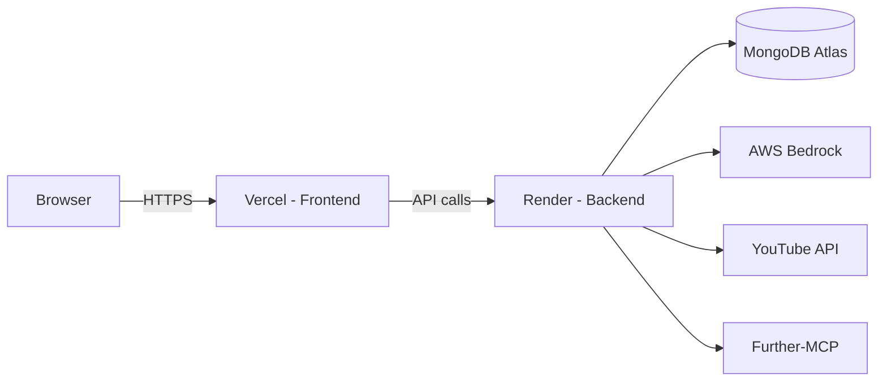

# Deployment Guide

## Environment Variables

### Backend (`backend/.env`)

| Variable | Required | Description |
|----------|----------|-------------|
| `MONGODB_URI` | Yes | MongoDB connection string |
| `JWT_SECRET` | Yes | Secret for signing JWTs (must match frontend) |
| `GOOGLE_CLIENT_ID` | Yes | Google OAuth client ID |
| `GOOGLE_CLIENT_SECRET` | Yes | Google OAuth client secret |
| `FRONTEND_URL` | Yes | Frontend origin (e.g., `https://thetutor.vercel.app`) |
| `AWS_ACCESS_KEY_ID` | Yes | AWS credentials for Bedrock AI |
| `AWS_SECRET_ACCESS_KEY` | Yes | AWS credentials for Bedrock AI |
| `AWS_REGION` | Yes | AWS region (e.g., `us-east-1`) |
| `AI_MODEL` | No | Bedrock model ID override |
| `YT_API_KEY` | Yes | YouTube Data API key for video enrichment |
| `PORT` | No | Server port (default: 5000) |

### Frontend (`frontend/.env.local`)

| Variable | Required | Description |
|----------|----------|-------------|
| `NEXT_PUBLIC_BACKEND_URL` | Yes | Backend origin (e.g., `https://api.thetutor.com`) |
| `JWT_SECRET` | Yes | Must match backend `JWT_SECRET` exactly |
| `PORT` | No | Dev server port (default: 3000) |
| `MONGODB_URI` | Yes | MongoDB connection string (for server-side operations) |
| `GOOGLE_CLIENT_ID` | Yes | Google OAuth client ID |
| `GOOGLE_CLIENT_SECRET` | Yes | Google OAuth client secret |
| `FRONTEND_URL` | Yes | Frontend origin (for callback URLs) |

## Platform Setup

### Frontend — Vercel

1. Import the repository in Vercel
2. Set **Root Directory** to `frontend/`
3. **Build Command:** `npm run build`
4. **Output Directory:** `.next` (auto-detected)
5. Add all frontend environment variables in Vercel project settings
6. Deploy

### Backend — Render or Railway

#### Render

1. Create a new **Web Service** connected to the repository
2. Set **Root Directory** to `backend/`
3. **Build Command:** `npm run build`
4. **Start Command:** `node dist/index.js`
5. Add all backend environment variables in the service settings
6. Deploy

#### Railway

1. Create a new service from the repository
2. Set root to `backend/`
3. **Build Command:** `npm run build`
4. **Start Command:** `node dist/index.js`
5. Add environment variables in the service settings
6. Deploy

## Production Checklist

- [ ] `JWT_SECRET` matches between frontend and backend
- [ ] `FRONTEND_URL` matches the actual frontend origin exactly (no trailing slash)
- [ ] CORS origin in backend is set to `FRONTEND_URL`
- [ ] `NODE_ENV=production` is set on the backend
- [ ] Cookies are configured for HTTPS (secure flag) in production
- [ ] MongoDB connection string uses a production cluster with authentication
- [ ] Google OAuth redirect URI is updated in Google Cloud Console to point to the production backend callback
- [ ] AWS Bedrock model access is enabled in the configured region

## Architecture Diagram (Production)

